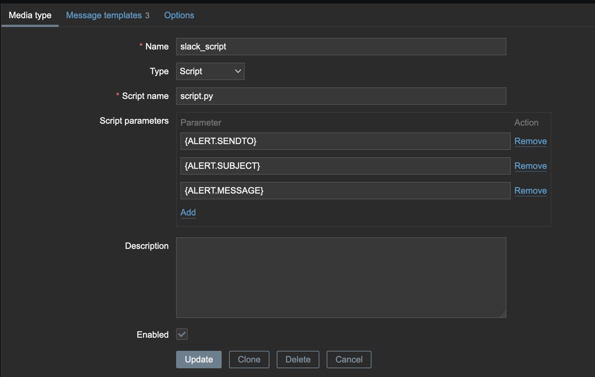
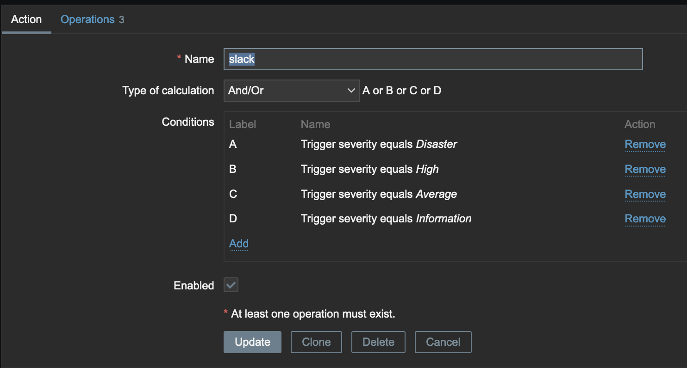
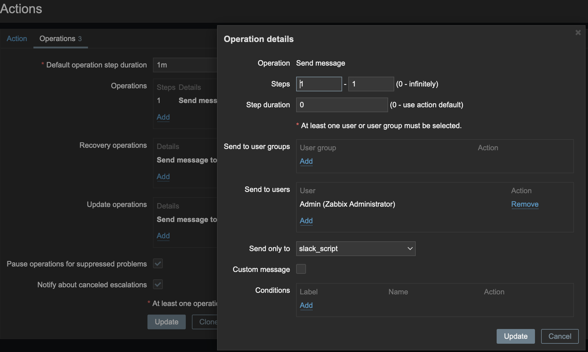
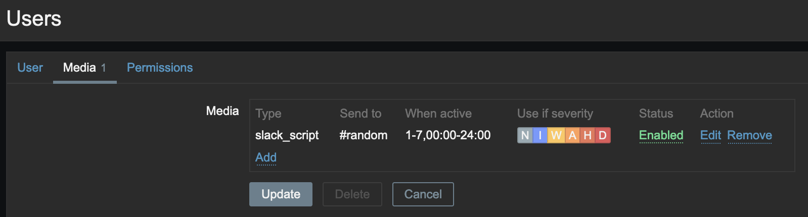
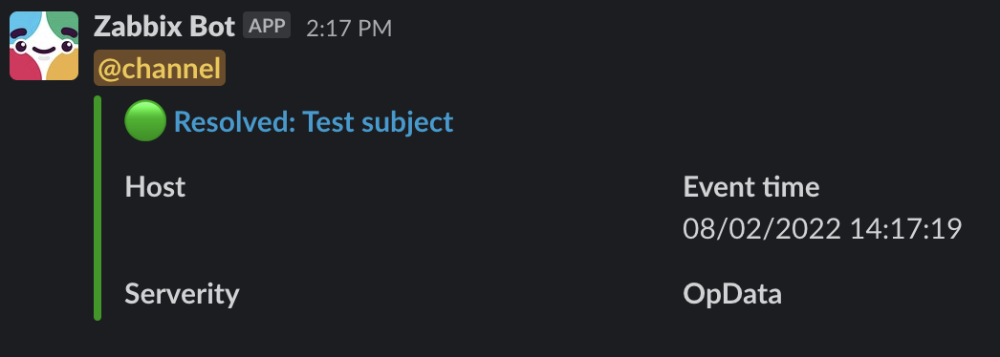

# Quick-start

## Installing the Python Script 
It is recommended to use Python 3.6 and above with pip to install ```slack-sdk``` package. If you're unsure how to check what version of Python you're on, you can check it using the following:

> <b>Note:</b> You may need to use ```python3``` before your commands to ensure you use the correct Python path. e.g. ```python3 --version```

```bash
python --version 

-- or --

python3 --version
```

Then proceed to install the Slack Development Kit for Python

```bash
pip install slack_sdk
```

> <b>Note:</b> Depending on your Zabbix installation, whether you enable a home folder for Zabbix or not during the installation, because pip always install to non-root user environment

Copy ```slack_script.py``` to ```/usr/lib/zabbix/alertscripts```. This depends on your Zabbix Server Configuration, the configuration usually can be found at ```/etc/zabbix/zabbix_server.conf```

Copy the Slack Token in your Slack app and paste it in ```client = WebClient(token=("TOKEN_HERE"))``` where it said TOKEN_HERE. If you don't have one already yet, checkout this [URL](https://slack.com/help/articles/215770388-Create-and-regenerate-API-tokens).

> The Token will looks like this 
xoxX-XXXXXXXXXXXXX-XXXXXXXXXXXXX-XXXXXXXXXXXXXXXXXXXXXX

## Create New Media Type
Go to your Zabbix server and follow this step to create media type: 
```Administration``` -> ```Media types``` -> ```Create media type```

Enter the field then click ```Update```


## Create New Action
Go to your Zabbix server and follow this step to create action:
```Configuration``` -> ```Actions``` -> ```Trigger actions``` -> ```Create action```

You can either enter the default subject and message then click ```Add``` or just leave it empty, and use the custom message from the ```operations``` tab



> The type of subject and message determine the behavior of the script for example this script works with this subject template 

```
Host>{HOST.NAME}>Severity>{TRIGGER.SEVERITY}>opdata>{ITEM.VALUE1}>eventid>{EVENT.ID}>status>{TRIGGER.STATUS}>triggerid>{TRIGGER.ID}>group>{TRIGGER.HOSTGROUP.NAME}
```

> This section of the script is a function that will extract the required value and assign it to its corresponding variable. For example, ```argv1``` is for keyword and ```argv2``` are for the value that keyword contains, these keywords are separated by a special character that you designated in this case an asterisk "*"

```python
def shell_command(argv1, argv2):
    return subprocess.getoutput(f"echo {message} | grep {argv1} | cut -d '*' -f{argv2}")
```

## Add new Media To The User 

Go to your Zabbix server and filling the necessary information for new user group:
```Administration``` -> ```Users``` -> ```Media``` -> ```Edit``` -> ```Type``` -> ```Update```



## Example
> The message will look like this 

