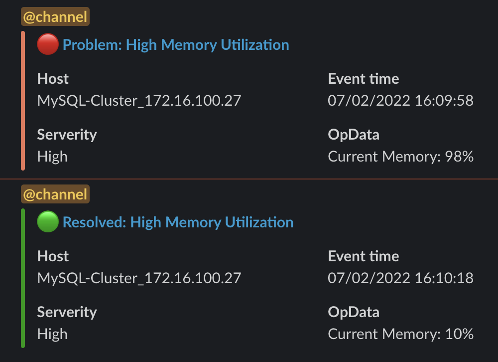

# Zabbix Slack notifications

Simple scripts to send alert notifications to slack from Zabbix. The scripts support python and shell script with different way of sending notification to slack

# Quick-start
Slack support many access methods, this method have different way of sending message to Slack. For example, Slack have dedicated access method for Python, Java and JavaScript through supported module, but outside these are not supported and have to use HTTP method such as a shell script

## HTTP Method
Shell script use HTTP method to send message to Slack via ```Incoming Webhook``` with the ```POST``` method 
* For Zabbix [2.4](./guide-2.4.md) 
* For Zabbix [5.4](./guide-5.4.md)

## Dedicated Post Method

Slack support dedicated ```chat.postMessage``` for languages such as ```JavaScript```, ```Python``` and ```Java```. Checkout this Python [Guide](./python-guide.md)

## Creating Rich Message Layouts

Structure complex data in an easily readable and understandable way within messages. You can learn more about it at their official [document](https://api.slack.com/messaging/composing/layouts)

## Example

